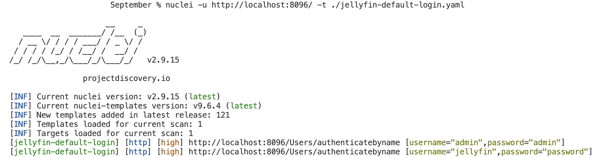

# September Creation

For our September creation, we have added to the open source vulnerability scanner [Nuclei](https://github.com/projectdiscovery/nuclei) by [Project Discovery](https://github.com/projectdiscovery)

## Nuclei
### How it works
Nuclei works by sending requests to targets to scan for vulnerabilities based on predefined templates. For example, you can use Nuclei with a default-login template to see if a web app is using any default credentials.

### Installing Nuclei
Nuclei requires **go1.20** to install successfully. Run the following command to install the latest version -

```sh
go install -v github.com/projectdiscovery/nuclei/v2/cmd/nuclei@latest
```

<details>
  <summary>Brew</summary>

  ```sh
  brew install nuclei
  ```
</details>
<details>
  <summary>Docker</summary>

  ```sh
  docker pull projectdiscovery/nuclei:latest
  ```
</details>

### Usage
```sh
nuclei -u <target> -t <path_to_template>
```

Installing Nuclei will install all nuclei templates by default. You can specify specific templates or directories of templates to use. Nuclei will use all templates if none are specified.

## Jellyfin
### What is Jellyfin

Jellyfin is a home media server program. A computer hosting Jellyfin can act as a media storage and viewing server for any computer on the local area network. The Jellyfin server will host a web application for users to access and view the media.

### Installing Jellyfin

Jellyfin can be easily installed on multiple operating systems or run in a containerized environment. Installation instructions can be found here: https://jellyfin.org/docs/general/installation/ 

## Proof of concept 

### Using Jellyfin Nuclei Template

To use our custom Jellyfin Nuclei template, follow the steps below:

1. Make sure that you have Nuclei installed on your host.
2. Start the Jellyfin service. By default, Jellyfin will run on port 8096.
3. Navigate to your Jellyfin server by visiting http://localhost:8096/ in your browser
4. Setup Jellyfin with weak credentials. Ex: ```admin:admin```
5. Clone this repository and enter the 'September' directory.
6. In a command prompt, run: ```nuclei -u http://localhost:8096/ -t ./jellyfin-default-login.yaml ```

If executed correctly, the result output should look something like this:<br />
<br />


<br />
<br />
As you can see the template was able to discover default credentials `admin:admin` and `jellyfin:password`